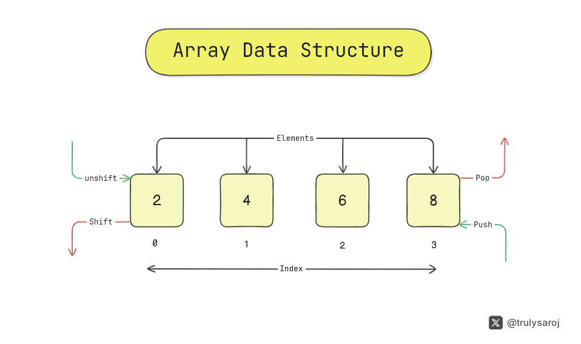

# 🟨 Array Data Structure
The array is, the most common data structure in computer programming, a collection of items of some data type stored at contiguous (one after another) memory locations . Every programming language includes some form of array. Because arrays are built-in, they are usually very efficient and are considered good choices for many data storage purposes.




<br>
JavaScript array is actually a specialized type of JavaScript object, with the indices
being property names that can be integers used to represent offsets. However, when
integers are used for indices, they are converted to strings internally in order to conform
to the requirements for JavaScript objects. The Array is one of the recognized JavaScript
object types, and as such, there is a set of properties and functions you can use with
arrays.


## Time Complexity of Array

| Algorithm | Average case | Worst case |
| --------- | ------------ | ---------- |
| Access    | O(1)         | O(1)       |
| Search    | O(n)         | O(n)       |
| Insertion | O(n)         | O(n)       |
| Deletion  | O(n)         | O(n)       |


**The space complexity of an array for the worst case is O(n).**

<br>

## 🟡 Types of Arrays

**Static arrays:**

The size or number of elements in static arrays is fixed. (After an array is created and memory space allocated, the size of the array cannot be changed.)
The array's content can be modified, but the memory space allocated to it remains constant.


**Dynamic arrays:**

The size or number of elements in a dynamic array can change. (After an array is created, the size of the array can be changed – the array size can grow or shrink.)
Dynamic arrays allow elements to be added and removed at the runtime. (The size of the dynamic array can be modified during the operations performed on it.)


## 🟡 When should an Array be used?
Arrays are excellent for quick lookups. Pushing and popping are really quick.
Here are the some use ideal usecase for arrays:
- Sequential storage and indexed access
- Efficient random access by index
- Maintaining order of elements
- Easy iteration over elements
- Suitable for static or fixed-size collections
- Efficient stack or queue operations

**Props of Array**
- Fast lookups
- Fast push/pop
- Ordered

**Cons of Array**
- Slow inserts
- Slow deletes
- Fixed size* (if using static array)

<hr> <br>

## 🟡 Operation with Array
Arrays in JavaScript are very flexible. There are several different ways to create arrays,
access array elements, and perform tasks such as searching and sorting the elements
stored in an array

### Creating Arrays
The simplest way to create an array is by declaring an array variable using the [] oper‐
ator:
```javascript
let numbers = [];
print(numbers.length); //  0

var numbers = [1,2,3,4,5];
print(numbers.length); // displays 5


// creating an array by calling the Array constructor:
var numbers = new Array(1,2,3,4,5);
print(numbers.length); // displays 5


// Creating  array by calling the Array constructor with specifying the length of the array: (Staic / Fixed length Array)
var numbers = new Array(10);
print(numbers.length); // displays 10


// Array with dynamic data types:
var objects = [1, "Joe", true, null];


// Checking is array or not:
var numbers = 3;
var arr = [7,4,1776];
print(Array.isArray(number)); // displays false
print(Array.isArray(arr)); // displays true


```


### Adding elements into Array

```javascript
const arr = [1, 2, 3, 4];

// adding element
arr.push(5); // O(1)
console.log(arr); // [1, 2, 3, 4, 5]
arr.unshift(0); // O(n)
console.log(arr); // [0, 1, 2, 3, 4 ]

```


### Removing elements from Array

```javascript
const arr = [1, 2, 3, 4];

// removing element
arr.pop(); // O(1)
console.log(arr); // [1, 2, 3]
arr.shift(); // O(n)
console.log(arr); // [2, 3, 4]

```


### Removing & Adding elements from  form specific index:

```javascript
// adding & removing elements form specific index:
let myNum = [1, 2, 5, 6];
newArr = [3, 4];

myNum.splice(2, 0, ...newArr);
console.log(myNum); //[1, 2, 3, 4, 5, 6]

myNum.splice(2, 3);
console.log(myNum); //[1, 2, 6];

```


### Searching for elemens in Array:

```javascript
// simple search for the maximum value in array
function findMaxNum(arr) {
  if (arr.length === 0) {
    return "Oops, This is an empty array !!";
  }

  let maxNum = arr[0];
  for (let i = 1; i < arr.length; i++) {
    if (arr[i] > maxNum) {
      maxNum = arr[i];
    }
  }
  return maxNum;
}

console.log(findMaxNum([2, 1, 5, 20, 32, 0])); //32

```

